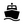
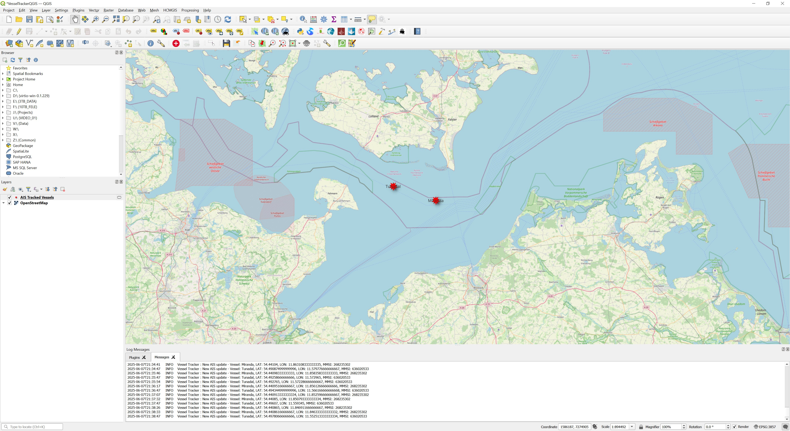

#   Vessel Tracker QGIS Plugin

Vessel Tracker is a plugin for QGIS that allows you to track real-time positions of maritime vessels directly on your map canvas. It uses a live AIS (Automatic Identification System) data stream from [aisstream.io](https://aisstream.io/) and plots vessel locations as points on a memory layer.



## Features

* **Real-Time Tracking:** Connects to a live AIS data stream to plot vessel positions as they are reported.
* **Multi-Vessel Support:** Track multiple vessels simultaneously.
* **Persistent Vessel List:** Your list of tracked vessels is saved between QGIS sessions.
* **User-Friendly Configuration:** An intuitive dialog allows you to add or remove vessels to track by their MMSI (Maritime Mobile Service Identity) and a custom name.
* **Automatic Layer Creation:** Automatically creates and manages a memory layer named "AIS Tracked Vessels" to display the data.

## Dependencies

This plugin requires the `websockets` Python library to connect to the AIS data stream. Before installing the plugin, you need to install this dependency into the Python environment used by QGIS.

The easiest way to do this is to open the **QGIS OSGeo4W Shell** (found in your Start Menu with your QGIS installation) and run:

```bash
pip install websockets
```

## Installation

1.  Go to the [Releases page](https://github.com/your-username/your-repo/releases) of this GitHub repository. <!-- Update this link -->
2.  Download the latest `VesselTracker.zip` file.
3.  Create an account in https://aisstream.io/ and get your API key for free
4.  Paste your API key in the code of ais_worker
5.  Open QGIS.
6.  Navigate to **Plugins -> Manage and Install Plugins...**.
7.  In the dialog, select the **Install from ZIP** tab.
8.  Click the `...` button and browse to the `VesselTracker.zip` file you downloaded.
9.  Click the **Install Plugin** button.
10.  Once installed, ensure the plugin is enabled by checking the box next to "Vessel Tracker" in the **Installed** tab.

You should now see the Vessel Tracker icon (a ship) in your QGIS toolbar.

## How to Use

1.  **Launch the Plugin:** Click the **Vessel Tracker** icon in the QGIS toolbar.
2.  **Configure Vessels:** A dialog will appear.
    * The table will be pre-populated with any vessels you have tracked before.
    * To track a new vessel, click the **Add** button and enter its **MMSI** and a **Name** you want to use for its label.
    * To stop tracking a vessel, select its row and click the **Remove** button.
3.  **Start Tracking:** Click the **OK** button.
    * The plugin will connect to the AIS stream.
    * The "AIS Tracked Vessels" layer will be added to your Layers Panel if it isn't already there.
    * As position reports are received, points will appear and move on your map. A message will also appear in the QGIS Message Bar for each update.
4.  **Re-configuring:** To add or remove vessels, simply click the Vessel Tracker icon again. The current tracking session will stop, and the dialog will re-appear. After you click "OK", a new session will start with the updated vessel list.
5.  **Stopping the Tracker:** To stop the tracking, you can either:
    * Click the icon and then click **Cancel** in the dialog.
    * Unload the plugin through the **Manage and Install Plugins** dialog.
    * Close QGIS.

## Troubleshooting

#### Q: I clicked "OK" but no vessels are appearing on the map.
* **Wait a few seconds:** Sometimes the AIS position data can take several seconds or even minutes to come
* **Check MMSI:** Ensure the MMSI numbers you entered are correct.
* **Check Internet Connection:** The plugin requires an active internet connection to receive data.
* **Data Availability:** The vessel must be actively broadcasting its position within the geographical area covered by the data stream (the default is Europe). If a vessel is in port or has its AIS transponder turned off, no data will be received.
* **Check Logs:** Look at the QGIS Log Messages Panel (**View -> Panels -> Log Messages**) for any error messages.

#### Q: The plugin crashed QGIS.

* This plugin uses multi-threading, which can sometimes be unstable. If a crash occurs, please restart QGIS. The stability has been improved, but if you encounter a repeatable crash, please [open an issue](https://github.com/your-username/your-repo/issues) on GitHub. <!-- Update this link -->

#### Q: The plugin icon does not appear after installation.

* Ensure the `websockets` dependency is installed correctly in your QGIS Python environment (see **Dependencies** section).
* Go to **Plugins -> Manage and Install Plugins...** and ensure the "Vessel Tracker" plugin is checked (enabled) in the **Installed** tab.


## Note on API Key

This plugin uses a public data stream from `aisstream.io`. The source code includes a hardcoded API key for demonstration and basic use. For heavy or critical use, it is highly recommended that you register for your own free API key at [aisstream.io](https://aisstream.io/) and replace the one in the `ais_worker.py` file.

## Author
This plugin was created by Vicente Danvila. 
